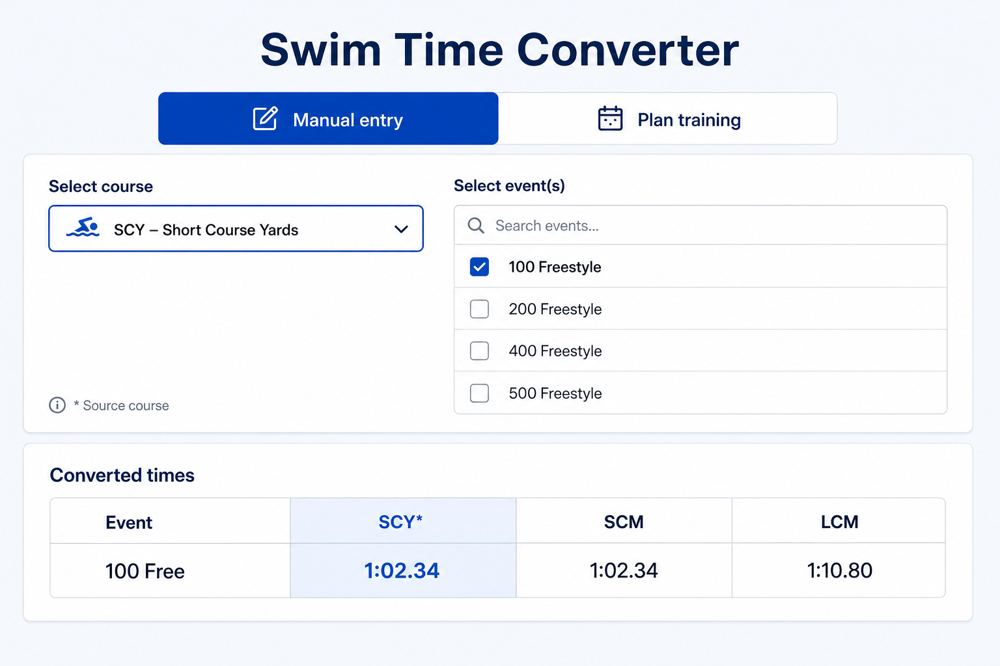
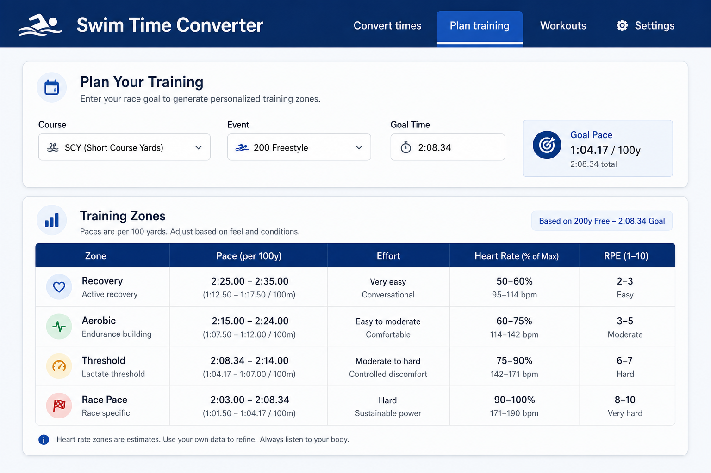

# Swim Time Converter

Convert swimming times between **SCY**, **SCM**, and **LCM**, and generate training zone paces from a goal time — built for coaches and competitive swimmers.

**[Live demo](https://alejoarte.github.io/swim-time-converter/)**


## Screenshots

| Manual conversion                                   | Plan training                                |
| --------------------------------------------------- | -------------------------------------------- |
|  |  |

## Features

- **Manual entry** — select one source course, pick events, enter times in `MM:SS.hh` or `SS.hh` format
- **Plan training** — enter a goal time and generate training zone paces from multiple zone systems
- Generate conversion tables on demand (SCY, SCM, LCM columns)
- Export conversion or training zone results to Excel (`.xlsx`)
- **Shareable plan links** — copy a URL that opens Plan training with the same course, event, goal time, and zone settings pre-loaded
- Comma decimal times (`59,24`) supported for European/Latin American entry
- English and Spanish UI with browser locale detection

## Why I built this

Swim coaches routinely convert times between short-course yards, short-course meters, and long-course meters when comparing meets, setting goals, or planning workouts. Existing tools like SwimSwam's Classic Converter handle conversions well, but I wanted a single app that also supports **training zone planning**, **Excel export**, **shareable plan URLs**, and **bilingual UI** — with conversion logic implemented in typed, testable TypeScript rather than opaque spreadsheet formulas.

## Architecture

```
events.ts (catalog)  →  convert.ts / trainingZones.ts (domain logic)  →  components (UI)
                              ↓
                    timeParse.ts, shareUrl.ts, exportExcel.ts
```

| Layer             | Responsibility                                        |
| ----------------- | ----------------------------------------------------- |
| `src/data/`       | Event catalog and training zone system definitions    |
| `src/lib/`        | Pure conversion, parsing, share URL, and export logic |
| `src/components/` | React UI; no business rules                           |
| `src/locales/`    | i18next strings (English / Spanish)                   |

**Tech decisions:** Vite for fast builds and GitHub Pages deployment; vanilla CSS instead of a component library to keep bundle size small; i18next for locale support without coupling UI to translation files; Vitest for unit tests on domain logic.

## Local development

```bash
npm install
npm run dev
```

Open `http://localhost:5173/swim-time-converter/` (note the base path).

## Scripts

| Command                | Description                 |
| ---------------------- | --------------------------- |
| `npm run dev`          | Start dev server            |
| `npm run build`        | Production build to `dist/` |
| `npm run preview`      | Preview production build    |
| `npm run test`         | Run Vitest unit tests       |
| `npm run lint`         | ESLint                      |
| `npm run format:check` | Prettier check              |

## Deployment (GitHub Pages)

1. Push to the `main` branch — the [CI workflow](.github/workflows/ci.yml) runs lint, format, tests, and build; on success it deploys to the `gh-pages` branch.
2. In your repo **Settings → Pages**, set source to **Deploy from branch**, branch `gh-pages`, folder `/ (root)`.
3. Visit [https://alejoarte.github.io/swim-time-converter/](https://alejoarte.github.io/swim-time-converter/).

## Conversion model

This app uses the **Classical (Colorado Timing) course conversion factors** from [SportsEngine Motion — How to perform course conversion factoring of times](https://motion-help.sportsengine.com/en/articles/8538107-how-to-perform-course-conversion-factoring-of-times) (same model as SwimSwam's Classic Converter).

### Conversion factors (`fFactor`)

| Factor        | Value  | When used                          |
| ------------- | ------ | ---------------------------------- |
| Standard      | 1.11   | Most events (SCY ↔ LCM/SCM)        |
| Distance free | 0.8925 | 500y/1000y freestyle               |
| 1650 free     | 1.02   | SCY 1650 → LCM 1500                |
| SCM ↔ LCM     | 1.0    | Short ↔ long course meters         |

Distance factors (0.8925 and 1.02) apply only to **distance freestyle** yard↔meter pairs (e.g. 500y↔400m). **400 IM** uses the standard 1.11 factor plus the medley increment on SCY↔LCM.

### Time increments (`fIncre`, in centiseconds)

**Stroke increments** (per 50 yards/meters of stroke, scaled by event distance):

| Stroke  | Increment |
| ------- | --------- |
| Fly     | 70        |
| Back    | 60        |
| Breast  | 100       |
| Free    | 80        |
| IM      | 80        |

For 100, 200, and 400 events, the stroke increment is multiplied by 2×, 4×, and 8× respectively.

**Distance increments** (SCM ↔ LCM and some SCY ↔ LCM pairs):

| Event pair   | Increment |
| ------------ | --------- |
| 500y / 400m  | 640       |
| 1000y / 800m | 1280      |
| 1650y / 1500m | 2400     |

SCY ↔ SCM conversions use `fIncre = 0`.

### Formulas

All times are in centiseconds (hundredths of a second):

- SCY → LCM/SCM: `time × fFactor + fIncre`
- LCM → SCY/SCM: `(time − fIncre) / fFactor`
- SCM → SCY: `time / fFactor`
- SCM → LCM: `time + fIncre`
- LCM → SCM: `(time − fIncre) / fFactor`

**Disclaimer:** Converted times are estimates and are not official. They cannot be used for records or qualification purposes.

## Shareable plan links

In **Plan training**, after the zone table appears, use **Copy link** to copy a URL. Anyone who opens that link lands in Plan mode with the same settings and sees the zone table immediately.

Example query parameters:

```
?plan=1&c=SCY&e=200-free&t=12834&z=a-system&o=fixed
```

| Param  | Meaning                                                                        |
| ------ | ------------------------------------------------------------------------------ |
| `plan` | Always `1` for plan share links                                                |
| `c`    | Course: `SCY`, `SCM`, or `LCM`                                                 |
| `e`    | Event id (e.g. `200-free`)                                                     |
| `t`    | Goal time in centiseconds                                                      |
| `z`    | Zone system: `a-system`, `us-system`, or `dual` (optional, default `a-system`) |
| `o`    | Pace model: `fixed` or `percent` (optional, default `fixed`)                   |
| `lng`  | UI language: `en` or `es` (optional)                                           |

Shared links include your goal time in the URL. Only share with people you trust.

## Testing

Unit tests cover conversion math, time parsing, and share URL round-trips:

```bash
npm run test
```

Key cases (also in the manual smoke checklist below):

- SCY 100 Free `1:02.34` → LCM `1:10.80`
- Invalid share link `t=abc` parses as `null` without crashing

## Manual smoke test checklist

- [ ] Select SCY, pick 100 Free, enter `1:02.34`, generate — LCM shows ~`1:10.80`
- [ ] Select multiple events, verify all appear in results table
- [ ] Source column is highlighted with `*`
- [ ] Edit times scrolls back and clears results
- [ ] Export downloads a valid `.xlsx` file
- [ ] App loads correctly from GitHub Pages URL (with `/swim-time-converter/` base path)
- [ ] Plan training: enter goal time, verify zone table and Excel export
- [ ] Plan training: Copy link → open in incognito → plan mode loads with same zones
- [ ] Invalid share link (`?plan=1&c=SCY&e=200-free&t=abc`) shows warning, no crash

## GitHub profile setup

After pushing, on [github.com/alejoarte/swim-time-converter](https://github.com/alejoarte/swim-time-converter):

1. **Settings → General** — set **Website** to `https://alejoarte.github.io/swim-time-converter/`
2. **About** (gear on repo home) — add description and topics: `react`, `typescript`, `vite`, `swimming`, `i18n`, `github-pages`
3. **Your profile** — pin this repository

## Tech stack

- Vite + React 19 + TypeScript
- Vitest (unit tests)
- i18next (English / Spanish)
- SheetJS (`xlsx`) for Excel export

## License

[MIT](LICENSE)
